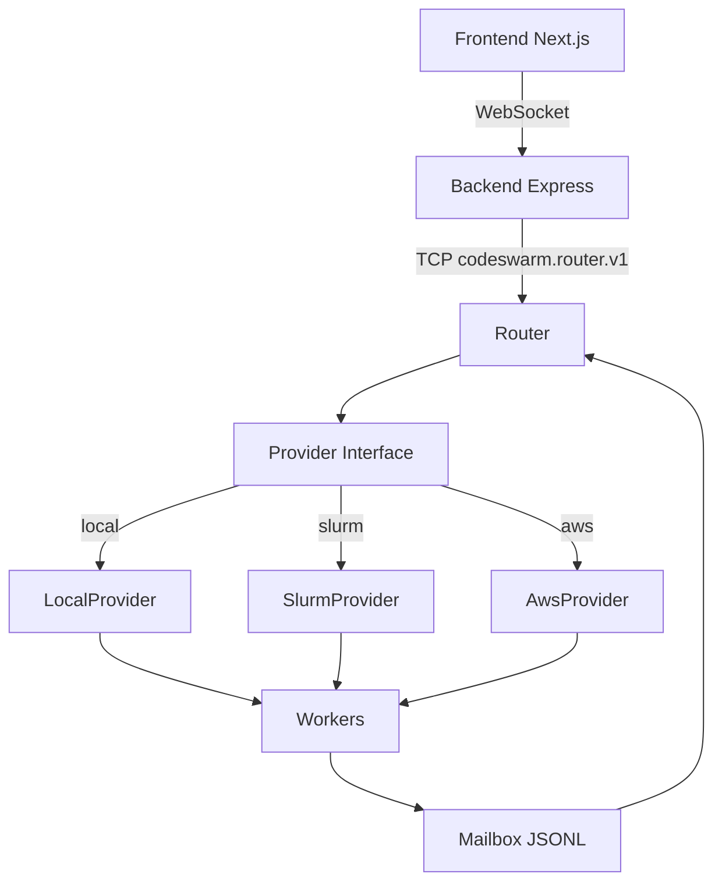

# Codeswarm

Codeswarm is a provider-agnostic execution system for orchestrating multi-node Codex workers on:

- Local processes (single machine)
- Slurm clusters (HPC)
- AWS EC2 + shared EBS

It provides a router control plane, a backend API/WebSocket bridge, and a Next.js frontend.

Current implementation includes two complementary operating modes:

- ad hoc swarm operation with direct prompt routing
- opt-in orchestrated projects with planner-generated task graphs, deterministic worker dispatch, live project/task UI, and project resume

## Install a Release

```bash
curl -fsSL https://raw.githubusercontent.com/kalowery/codeswarm/main/install-codeswarm.sh | bash
```

That installer downloads the latest published release bundle from GitHub Releases, installs the bundled Python wheel into a private virtualenv, installs CLI/backend runtime dependencies, and writes a `codeswarm` launcher into `~/.codeswarm/bin`.

To pin installation to a specific published release, fetch the installer from that tag:

```bash
curl -fsSL https://raw.githubusercontent.com/kalowery/codeswarm/v0.1.2/install-codeswarm.sh | bash
```

Optional installer overrides:

- `CODESWARM_INSTALL_DIR` (default: `~/.codeswarm`)
- `CODESWARM_RELEASE_URL`
- `CODESWARM_RELEASE_ARCHIVE`
- `CODESWARM_INSTALL_MODE=release|source`
- `CODESWARM_REPO_URL` and `CODESWARM_BRANCH` for source-mode installs only

## Quick Start (Local)

1. Install a published release

```bash
curl -fsSL https://raw.githubusercontent.com/kalowery/codeswarm/main/install-codeswarm.sh | bash
```

2. Start the full web stack

```bash
codeswarm web --config ~/.codeswarm/configs/local.json
```

This starts:

- Router on `127.0.0.1:8765`
- Backend on `http://localhost:4000`
- Frontend on `http://localhost:3000`

## Bootstrap from a Git Clone

Use this path for development, branch testing, or when you want the working tree directly on disk.

1. Clone

```bash
git clone https://github.com/kalowery/codeswarm.git
cd codeswarm
```

2. Bootstrap dependencies

```bash
./bootstrap.sh
```

`bootstrap.sh` installs Node `24.13.0`, workspace dependencies, builds the frontend/backend/CLI artifacts, links the `codeswarm` CLI, and checks for optional Beads CLI (`bd`) with an optional install prompt.
It also installs the Python package in editable mode so `router`, `agent`, `slurm`, and related modules resolve directly from the git checkout.

If runtime packages are missing after branch switches or large git updates, run:

```bash
npm install --workspaces
```

Then rebuild the JS artifacts if needed:

```bash
npm run build:all
```

For a package-style Python install without the full bootstrap flow:

```bash
python3 -m pip install --user --break-system-packages -e .
```

If you are using a virtual environment, drop `--user --break-system-packages`.

3. Use local config

`configs/local.json` already exists and uses local backend:

```json
{
  "cluster": {
    "backend": "local",
    "workspace_root": "runs",
    "archive_root": "/tmp/archives"
  }
}
```

Note: `configs/combined.json` is intentionally treated as a local operator file and is not tracked by git.

4. Start the full web stack

```bash
codeswarm web --config configs/local.json
```

You can also run components manually from the checkout:

```bash
python3 -u -m router.router --config configs/local.json --daemon
npm --prefix web/backend run dev
npm --prefix web/frontend run dev
```

If you only want terminal-based swarm launch, you do not need the web stack:

```bash
codeswarm providers --config configs/local.json
codeswarm launch --nodes 2 --prompt "You are a focused autonomous agent." --provider local --config configs/local.json
codeswarm stop-all --config configs/local.json
```

Optional web-launch parity flags:

- `--agents <path>` accepts either a single `AGENTS.md` file or a persona directory containing `AGENTS.md` and optional `skills/`
- `--provider-param key=value` can be repeated for provider-specific launch fields
- `--provider-params-json '{"key":"value"}'` passes provider overrides as JSON
- `--detach` exits after launch; otherwise the CLI follows INFO activity logs by default

## Orchestrated Projects

Codeswarm now supports a deterministic project mode alongside normal swarm usage.

High-level flow:

1. Launch or select a planner swarm.
2. Launch one or more worker swarms.
3. In the web UI, create a project in one of two modes:
   - plan from a spec plus planner swarm
   - create directly from an explicit task list
4. Router schedules one task at a time to idle worker nodes, with each task executed on its own branch in an isolated per-worker repo checkout.
5. A final integration task is appended automatically and runs after implementation tasks complete.

Repository inputs supported by the project UI and backend:

- existing local git repo path
- existing GitHub repo reference
- GitHub owner/repo with create-if-missing behavior for project planning/execution flows

Project resume is also implemented:

- resume reconciles router project state against durable task branches in the canonical repo
- assigned tasks can be recovered or reset
- failed tasks can optionally be retried
- worker swarms can be replaced at resume time

CLI support:

```bash
codeswarm project resume-preview <project-id> --config configs/local.json
codeswarm project resume <project-id> --config configs/local.json
```

Recommended local launch presets for project work:

- `local-orchestrated-planner`
- `local-orchestrated-worker`

These presets default to real Codex workers, `approval_policy=never`, `sandbox_mode=danger-full-access`, native auto-approval, and orchestrated-worker-safe thread behavior. The same launch path now also supports `worker_mode=claude`.

## Codex Sandbox and Approval

Codeswarm handles execution approval in its own UI/router flow (`exec_approval_required` -> `/approval` -> router `approve_execution`).

To avoid conflicting prompts and write failures, configure Codex for workspace writes and no internal approval gate:

```toml
sandbox = "workspace-write"
approvalPolicy = "never"
```

Equivalent CLI flags:

```bash
codex --sandbox workspace-write --ask-for-approval never
```

If Codex is left in read-only or on-request modes, commands may execute inconsistently or fail to write files.

## Claude Runtime

Claude is supported as a local, AWS, and Slurm worker runtime through the Anthropic Claude Code SDK/CLI path.

- current support scope is local, AWS, and Slurm swarms, plus orchestrated project flows where the provider supports repository preparation
- select `worker_mode=claude` in the launch modal or provider defaults
- `approval_policy=never` maps to Claude bypass mode
- non-`never` approval policies route tool permissions through the normal Codeswarm approval UI
- if no `claude_env_profile` is selected, Claude inherits the router process environment as-is

The sample local configs include an AMD gateway profile named `amd-llm-gateway`. It expands `${LLM_GATEWAY_KEY}` from the host environment and injects:

- `ANTHROPIC_API_KEY=dummy`
- `ANTHROPIC_BASE_URL=https://llm-api.amd.com/Anthropic`
- `ANTHROPIC_CUSTOM_HEADERS=Ocp-Apim-Subscription-Key: ${LLM_GATEWAY_KEY}`
- model defaults such as `ANTHROPIC_DEFAULT_SONNET_MODEL`
- `CLAUDE_CODE_DISABLE_NONESSENTIAL_TRAFFIC=1`

Claude launch/runtime precedence is:

1. `worker_mode=claude` selects the Claude worker implementation.
2. `claude_env_profile` injects a named Anthropic environment bundle from the active provider backend config's `claude_env_profiles`.
3. If no profile is selected, the worker uses inherited host env such as `ANTHROPIC_API_KEY`, `ANTHROPIC_BASE_URL`, and `ANTHROPIC_MODEL`.
4. `claude_model` overrides the model passed to the Claude SDK for that swarm.
5. `pricing_model` can override billing lookup independently from the runtime-selected model.

Auth selection is therefore deterministic:

- profile selected: use the resolved profile values, with `${VAR}` placeholders expanded from the router host environment at launch time
- no profile selected: use whatever Anthropic env vars already exist in the router process environment
- placeholder missing: swarm launch fails rather than silently running with incomplete auth

This means Codeswarm will use plain `ANTHROPIC_API_KEY`-style environment configuration by default, and can also route Claude through the AMD LLM gateway when a profile injects gateway-specific values.

For containerized local workers, the default image is now the published GHCR image `ghcr.io/kalowery/codeswarm-local-worker:latest`.
If that image is not locally present, Codeswarm will try to pull it first and fall back to building from [local-worker.Dockerfile](/Users/klowery/codeswarm/docker/local-worker.Dockerfile) when a checkout is available.

## Model Pricing and Billing Tables

Router-side usage accounting is model-aware and no longer assumes a single model for the entire project.

- pricing tables live in the top-level `model_pricing` object in the router config, for example [configs/local.json](/Users/keithlowery/codeswarm/configs/local.json)
- router also ships with a built-in default catalog in [router/router.py](/Users/keithlowery/codeswarm/router/router.py)
- configured `model_pricing` entries override built-in defaults on a per-model basis
- launch-time `pricing_model` overrides the label used for spend lookup
- if `pricing_model` is omitted, router falls back to the resolved agent model; Codex defaults to `gpt-5.4`
- mixed-model task/project aggregates are labeled `mixed` when usage from different pricing models is combined

Each pricing entry currently supports:

- `input_tokens_usd_per_m`
- `cached_input_tokens_usd_per_m`
- `output_tokens_usd_per_m`
- `reasoning_output_tokens_usd_per_m`

The UI now surfaces router-computed spend totals at the swarm, task, and project levels, so the config file is the source of truth for token billing rates.

For protocol debugging, you can enable continuous raw session capture from each worker:

```bash
export CODESWARM_CAPTURE_ALL_SESSION=1
```

With that set before launch, workers emit every raw Codex session entry to mailbox outbox as `session_trace` records in addition to the normal `codex_rpc` stream. This applies to local, Slurm, and AWS worker launches.

## Architecture



Core principles:

- Provider abstraction: router is backend-neutral.
- Event-sourced UI: frontend state derives from streamed events.
- Mailbox contract: worker inbox/outbox JSONL files.
- Durable control state: `router_state.json` and backend `state.json`.

For local swarms on macOS and other non-Linux hosts, active-worker recovery now requires a fresh per-worker heartbeat rather than weak PID-only evidence. This prevents dead local swarms from being resurfaced as running after restart.

## Providers

### Local

- Spawns worker subprocesses.
- Uses mailbox under `<workspace_root>/mailbox` (default `runs/mailbox`).
- Optional archive move on terminate via `cluster.archive_root`.
- When archive is enabled, per-job workspace plus mailbox artifacts are archived together under one job directory.

### Slurm

- Submits jobs through `slurm/allocate_and_prepare.py`.
- Uses SSH (`cluster.slurm.login_host`, or profile-specific `cluster.slurm.profiles.<name>.login_host`) for `squeue`, `scancel`, inbox writes, and outbox follower.
- Mailbox under `<workspace_root>/<cluster_subdir>/mailbox`.

## Control Commands

Router command set (protocol `codeswarm.router.v1`):

- `swarm_launch`
- `inject`
- `enqueue_inject`
- `queue_list`
- `swarm_list`
- `swarm_status`
- `approve_execution`
- `swarm_terminate`
- `project_create`
- `project_plan`
- `project_start`
- `project_resume`
- `project_resume_preview`
- `project_list`

## Prompt Routing

UI prompt syntax supports both intra-swarm and cross-swarm targeting:

- `/all ...`
- `/node[0,2-4] ...`
- `/swarm[alias]/idle ...`
- `/swarm[alias]/idle/reply ...`
- `/swarm[alias]/first-idle ...`
- `/swarm[alias]/all ...`
- `/swarm[alias]/node[0,2-4] ...`

Cross-swarm `idle` routes use the router queue and dispatch to the first target node with no outstanding work.
The frontend sidebar also shows queued cross-swarm items (source/target/selector/age/content).

## Agent Personas

Codeswarm supports launching workers with an optional Agent Persona.

Agent Persona definition:

- a directory with:
  - `AGENTS.md` at directory root (required)
  - `skills/` subdirectory (optional)

Launch UI behavior:

- if a single file is selected, its content is copied into each worker workspace root as `AGENTS.md` (filename does not matter)
- if a directory is selected, only root `AGENTS.md` and files under `skills/` are copied
- persona skills are copied into each worker workspace root under `.agents/skills/...`
- repo root `AGENTS.md` is always prepended as a default baseline
- if no user file/directory AGENTS content is provided, the repo root `AGENTS.md` is used by itself

Sample personas are provided under:

- `personas/amd-gpu-developer`
- `personas/full-stack-web-developer`
- `personas/flutter-mobile-app-developer`
- `personas/swarm-tool-orchestrator`
- `personas/cuda-swarm-tool-client`
- `personas/cuda-swarm-responder`
- `personas/beads-task-graph-orchestrator`

## Auto-Routing From Task Completion

Backend inspects `task_complete` final assistant output and auto-submits any line that matches cross-swarm syntax:

- `/swarm[alias]/idle ...`
- `/swarm[alias]/idle/reply ...`
- `/swarm[alias]/first-idle ...`
- `/swarm[alias]/all ...`
- `/swarm[alias]/node[...] ...`

This enables self-sustaining multi-swarm workflows where one swarm emits follow-on work for another.

## Automated Testing

Current repository-level automation includes:

- CLI build: `npm --workspace=cli run build`
- headless browser UI tests: `npm run test:web-ui`
- local orchestrated project runtime smoke: `npm run test:project-runtime-smoke`
- orchestrated project resume smoke: `python3 tools/orchestrated_project_resume_smoke.py`

The browser suite uses Puppeteer and covers launch flows, project creation, worker interaction, and project resume behavior through the live frontend.

The project runtime smoke harness is runtime-aware and can be pointed at `mock`, `codex`, or `claude` for planner and worker swarms independently. Example:

```bash
python3 tools/orchestrated_project_runtime_smoke.py --planner-runtime codex --worker-runtime claude --mode both
python3 tools/orchestrated_project_runtime_smoke.py --planner-runtime claude --worker-runtime claude --mode planned
```

## Troubleshooting

### Codex not installed

```bash
npm install -g @openai/codex
```

### Codex not logged in

```bash
codex login
```

### Router not reachable

Ensure router daemon is running on port `8765`:

```bash
python3 -u -m router.router --config configs/local.json --daemon
```

### Frontend/Backend build check

```bash
npm --workspace=web/frontend run build
```

## Additional Docs

- `docs/CONFIG_SCHEMA.md`
- `docs/PROTOCOL.md`
- `docs/PROTOCOL_SPEC.md`
- `docs/PROVIDER_INTERFACE.md`
- `docs/USER_GUIDE.md`
- `docs/QA_TEST_PLAN.md`
