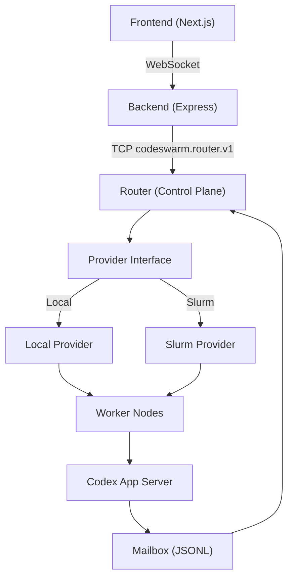
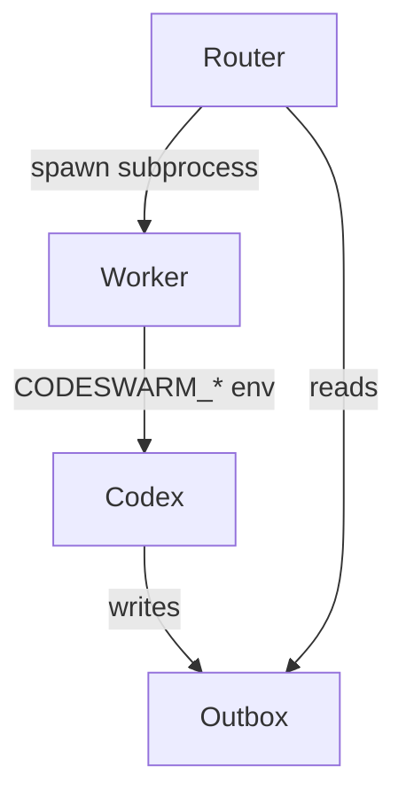
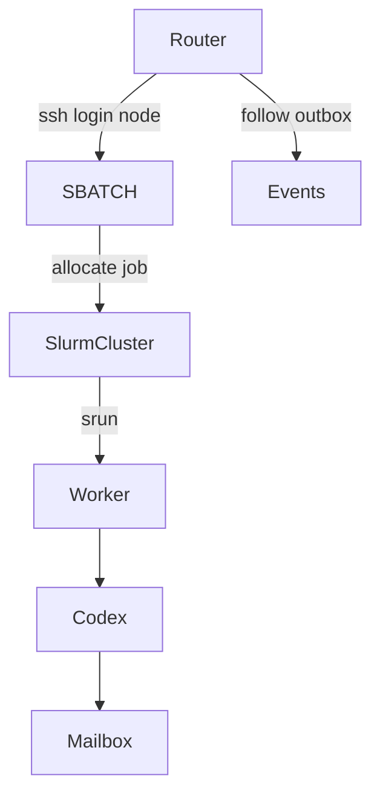
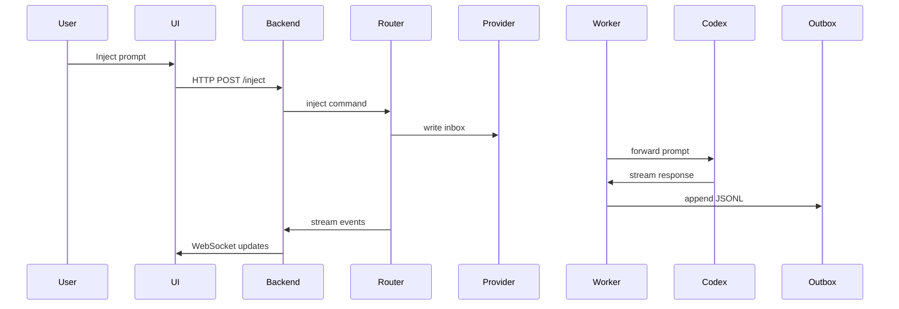

# Codeswarm

Codeswarm is a distributed, provider-agnostic execution system for running coordinated Codex workers across either:

- **Local processes** (single machine development mode)
- **Slurm clusters** (HPC production mode)

It provides a real-time, event-driven web UI for orchestrating multi-node AI swarms with durable state, streaming output, and clean backend abstraction.

---

# 🚀 Quick Start (Local Mode)

Codeswarm supports a one-command bootstrap setup.

## 1. Clone

```bash
git clone https://github.com/kalowery/codeswarm.git
cd codeswarm
```

## 2. Bootstrap

```bash
./bootstrap.sh
```

Bootstrap will:

- Install `nvm` if missing
- Install Node.js 24.13.0
- Install all dependencies (root, backend, frontend)
- Build the frontend
- Verify Codex CLI is installed
- Verify Codex CLI is authenticated

If Codex is not installed:

```bash
npm install -g @openai/codex
```

If Codex is not logged in:

```bash
codex login
```

---

## 3. Create a Local Config

Create a file named `local.json` in the repo root:

```json
{
  "cluster": {
    "backend": "local",
    "workspace_root": "runs",
    "archive_root": "/tmp/archives"
  }
}
```

---

## 4. Launch the Web UI

```bash
npx codeswarm web --config local.json
```

---

# 🛠 Troubleshooting

## ❌ Codex CLI not installed

```bash
npm install -g @openai/codex
```

## ❌ Codex CLI not logged in

```bash
codex login
```

## ❌ Node version mismatch

Codeswarm requires Node 24.13.0.

```bash
nvm install 24.13.0
nvm use 24.13.0
```

## ❌ Long-running sessions slow down browser

Codeswarm caps turn history at 300 turns per node to prevent unbounded DOM growth.
Modify `web/frontend/src/lib/store.ts` to adjust.


# Core Design Principles

- **Provider abstraction** — Router never depends on SSH or Slurm semantics.
- **Event-sourced UI** — Frontend derives state entirely from streamed events.
- **Mailbox contract** — Workers communicate via JSONL inbox/outbox files.
- **Stateless router** — JSONL logs are the source of truth.
- **Provider-neutral worker runtime** — No SLURM_* leakage into worker.

---

# High-Level Architecture



---

# Providers

Codeswarm currently supports two providers.

## ✅ Local Provider

Runs workers as subprocesses on the local machine.

Requirements:
- `codex` must be installed globally and authenticated.

Execution model:



Mailbox layout:

```
runs/mailbox/
  inbox/
  outbox/
```

No SSH. No Slurm. Pure local execution.

---

## ✅ Slurm Provider

Runs workers via SBATCH on an HPC cluster.

Execution model:



Mailbox layout:

```
<workspace>/<cluster_subdir>/mailbox/
  inbox/
  outbox/
```

Router does **not** know about SSH — that logic lives entirely inside the Slurm provider.

---

# Worker Contract

Workers depend only on these environment variables:

```
CODESWARM_JOB_ID
CODESWARM_NODE_ID
CODESWARM_BASE_DIR
CODESWARM_CODEX_BIN (optional)
```

Workers must NOT depend on:

- SLURM_*
- WORKSPACE_ROOT
- CLUSTER_SUBDIR

This guarantees provider neutrality.

---

# Launch → Inject → Stream Lifecycle



---

# Termination Model

Router delegates termination to provider:

```
provider.terminate(job_id)
```

- Local → kill subprocesses
- Slurm → `scancel` via SSH

Router never references SSH directly.

---

# UI Model

- Multiple swarms
- Each swarm has 1–N nodes
- Nodes render independent turn streams
- Attention indicators derive from completed turns
- HPC-safe horizontal node navigation with overflow controls

---

# Running Codeswarm

## ⚠️ Codex Sandbox & Approval Configuration (Important)

Codeswarm manages its own execution approval lifecycle at the router + UI layer.

For full functionality (including file writes from tools like `skill-creator`),
your local Codex configuration must allow workspace writes and disable
internal approval prompts.

Recommended `~/.codex/config.toml` settings:

```toml
sandbox = "workspace-write"
approvalPolicy = "never"
```

Alternatively, you may configure equivalent behavior via CLI flags when running
Codex manually:

```bash
codex --sandbox workspace-write --ask-for-approval never
```

If Codex is left in `read-only` or `on-request` mode, you may observe:

- Repeated escalation prompts
- "Sandbox rejected write" messages
- Commands executing but files not being written

Codeswarm assumes sandbox + approval are configured to allow execution after
UI approval.

---

## Local Mode

```bash
python -m router.router --config configs/local.json --daemon
```

Ensure:

```bash
printenv OPENAI_API_KEY | codex login --with-api-key
```

Then start frontend + backend.

---

## Slurm Mode

```bash
python -m router.router --config configs/hpcfund.json --daemon
```

Requires:
- SSH login alias configured
- Slurm cluster access

---

# Current Status

- ✅ Local provider stable
- ✅ Slurm provider stable
- ✅ Provider abstraction complete
- ✅ Multi-node UI stable
- ✅ Termination unified across providers

---

For deeper details, see:

- `docs/ARCHITECTURE.md`
- `docs/PROVIDER_INTERFACE.md`
- `docs/USER_GUIDE.md`
# Core Design Principles

- **Provider abstraction** — Router never depends on SSH or Slurm semantics.
- **Event-sourced UI** — Frontend derives state entirely from streamed events.
- **Mailbox contract** — Workers communicate via JSONL inbox/outbox files.
- **Stateless router** — JSONL logs are the source of truth.
- **Provider-neutral worker runtime** — No SLURM_* leakage into worker.

---

# High-Level Architecture


---

# Providers

Codeswarm currently supports two providers.

## ✅ Local Provider

Runs workers as subprocesses on the local machine.

Requirements:
- `codex` must be installed globally and authenticated.

Execution model:


Mailbox layout:

```
runs/mailbox/
  inbox/
  outbox/
```

No SSH. No Slurm. Pure local execution.

---

## ✅ Slurm Provider

Runs workers via SBATCH on an HPC cluster.

Execution model:


Mailbox layout:

```
<workspace>/<cluster_subdir>/mailbox/
  inbox/
  outbox/
```

Router does **not** know about SSH — that logic lives entirely inside the Slurm provider.

---

# Worker Contract

Workers depend only on these environment variables:

```
CODESWARM_JOB_ID
CODESWARM_NODE_ID
CODESWARM_BASE_DIR
CODESWARM_CODEX_BIN (optional)
```

Workers must NOT depend on:

- SLURM_*
- WORKSPACE_ROOT
- CLUSTER_SUBDIR

This guarantees provider neutrality.

---

# Launch → Inject → Stream Lifecycle


---

# Termination Model

Router delegates termination to provider:

```
provider.terminate(job_id)
```

- Local → kill subprocesses
- Slurm → `scancel` via SSH

Router never references SSH directly.

---

# UI Model

- Multiple swarms
- Each swarm has 1–N nodes
- Nodes render independent turn streams
- Attention indicators derive from completed turns
- HPC-safe horizontal node navigation with overflow controls

---

# Running Codeswarm

## ⚠️ Codex Sandbox & Approval Configuration (Important)

Codeswarm manages its own execution approval lifecycle at the router + UI layer.

For full functionality (including file writes from tools like `skill-creator`),
your local Codex configuration must allow workspace writes and disable
internal approval prompts.

Recommended `~/.codex/config.toml` settings:

```toml
sandbox = "workspace-write"
approvalPolicy = "never"
```

Alternatively, you may configure equivalent behavior via CLI flags when running
Codex manually:

```bash
codex --sandbox workspace-write --ask-for-approval never
```

If Codex is left in `read-only` or `on-request` mode, you may observe:

- Repeated escalation prompts
- "Sandbox rejected write" messages
- Commands executing but files not being written

Codeswarm assumes sandbox + approval are configured to allow execution after
UI approval.

---

## Local Mode

```bash
python -m router.router --config configs/local.json --daemon
```

Ensure:

```bash
printenv OPENAI_API_KEY | codex login --with-api-key
```

Then start frontend + backend.

---

## Slurm Mode

```bash
python -m router.router --config configs/hpcfund.json --daemon
```

Requires:
- SSH login alias configured
- Slurm cluster access

---

# Current Status

- ✅ Local provider stable
- ✅ Slurm provider stable
- ✅ Provider abstraction complete
- ✅ Multi-node UI stable
- ✅ Termination unified across providers

---

For deeper details, see:

- `docs/ARCHITECTURE.md`
- `docs/PROVIDER_INTERFACE.md`
- `docs/USER_GUIDE.md`
