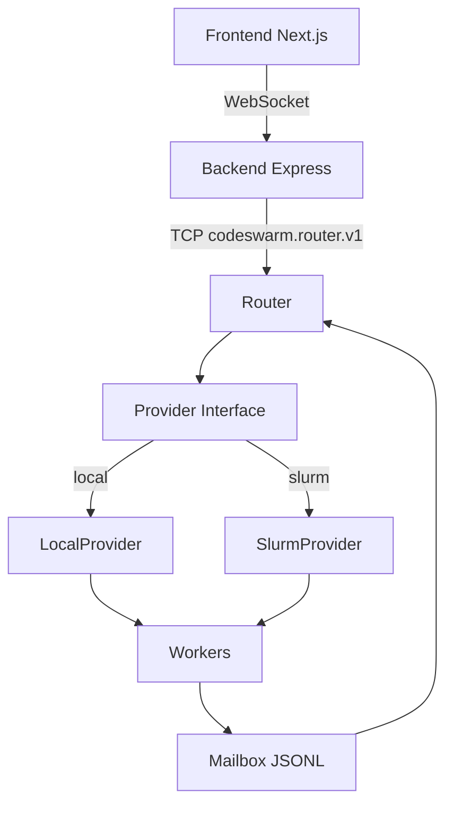

# Codeswarm

Codeswarm is a provider-agnostic execution system for orchestrating multi-node Codex workers on:

- Local processes (single machine)
- Slurm clusters (HPC)

It provides a router control plane, a backend API/WebSocket bridge, and a Next.js frontend.

## Install via curl | bash

```bash
curl -fsSL https://raw.githubusercontent.com/kalowery/codeswarm/main/install-codeswarm.sh | bash
```

Optional installer overrides:

- `CODESWARM_REPO_URL`
- `CODESWARM_BRANCH`
- `CODESWARM_INSTALL_DIR` (default: `~/.codeswarm`)

## Quick Start (Local)

1. Clone

```bash
git clone https://github.com/kalowery/codeswarm.git
cd codeswarm
```

2. Bootstrap dependencies

```bash
./bootstrap.sh
```

Bootstrap installs Node `24.13.0`, workspace dependencies, builds frontend/CLI, and verifies Codex CLI login.

3. Use local config

`configs/local.json` already exists and uses local backend:

```json
{
  "cluster": {
    "backend": "local",
    "workspace_root": "runs",
    "archive_root": "/tmp/archives"
  }
}
```

4. Start the full web stack

```bash
codeswarm web --config configs/local.json
```

This starts:

- Router on `127.0.0.1:8765`
- Backend on `http://localhost:4000`
- Frontend on `http://localhost:3000`

You can also run components manually:

```bash
python3 -u -m router.router --config configs/local.json --daemon
npm --prefix web/backend run dev
npm --prefix web/frontend run dev
```

## Codex Sandbox and Approval

Codeswarm handles execution approval in its own UI/router flow (`exec_approval_required` -> `/approval` -> router `approve_execution`).

To avoid conflicting prompts and write failures, configure Codex for workspace writes and no internal approval gate:

```toml
sandbox = "workspace-write"
approvalPolicy = "never"
```

Equivalent CLI flags:

```bash
codex --sandbox workspace-write --ask-for-approval never
```

If Codex is left in read-only or on-request modes, commands may execute inconsistently or fail to write files.

## Architecture



Core principles:

- Provider abstraction: router is backend-neutral.
- Event-sourced UI: frontend state derives from streamed events.
- Mailbox contract: worker inbox/outbox JSONL files.
- Durable control state: `router_state.json` and backend `state.json`.

## Providers

### Local

- Spawns worker subprocesses.
- Uses mailbox under `<workspace_root>/mailbox` (default `runs/mailbox`).
- Optional archive move on terminate via `cluster.archive_root`.

### Slurm

- Submits jobs through `slurm/allocate_and_prepare.py`.
- Uses SSH (`ssh.login_alias`) for `squeue`, `scancel`, inbox writes, and outbox follower.
- Mailbox under `<workspace_root>/<cluster_subdir>/mailbox`.

## Control Commands

Router command set (protocol `codeswarm.router.v1`):

- `swarm_launch`
- `inject`
- `enqueue_inject`
- `queue_list`
- `swarm_list`
- `swarm_status`
- `approve_execution`
- `swarm_terminate`

## Prompt Routing

UI prompt syntax supports both intra-swarm and cross-swarm targeting:

- `/all ...`
- `/node[0,2-4] ...`
- `/swarm[alias]/idle ...`
- `/swarm[alias]/first-idle ...`
- `/swarm[alias]/all ...`
- `/swarm[alias]/node[0,2-4] ...`

Cross-swarm `idle` routes use the router queue and dispatch to the first target node with no outstanding work.
The frontend sidebar also shows queued cross-swarm items (source/target/selector/age/content).

## Auto-Routing From Task Completion

Backend inspects `task_complete` final assistant output and auto-submits any line that matches cross-swarm syntax:

- `/swarm[alias]/idle ...`
- `/swarm[alias]/first-idle ...`
- `/swarm[alias]/all ...`
- `/swarm[alias]/node[...] ...`

This enables self-sustaining multi-swarm workflows where one swarm emits follow-on work for another.

## Troubleshooting

### Codex not installed

```bash
npm install -g @openai/codex
```

### Codex not logged in

```bash
codex login
```

### Router not reachable

Ensure router daemon is running on port `8765`:

```bash
python3 -u -m router.router --config configs/local.json --daemon
```

### Frontend/Backend build check

```bash
npm --workspace=web/frontend run build
```

## Additional Docs

- `docs/CONFIG_SCHEMA.md`
- `docs/PROTOCOL.md`
- `docs/PROTOCOL_SPEC.md`
- `docs/PROVIDER_INTERFACE.md`
- `docs/USER_GUIDE.md`
