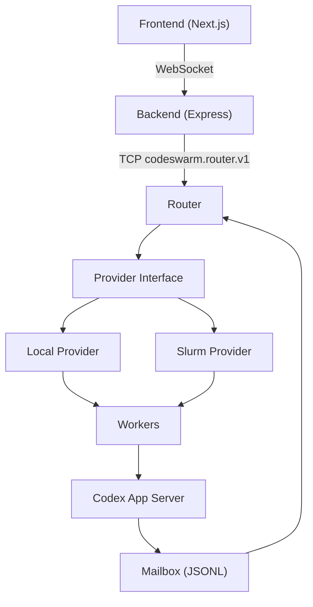
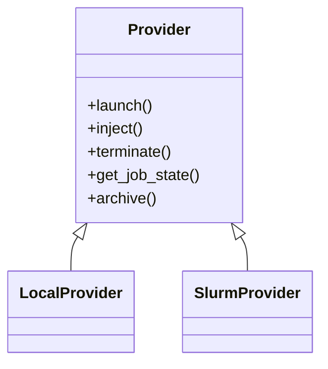
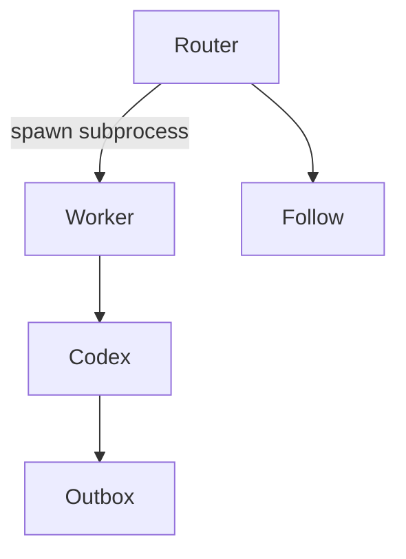
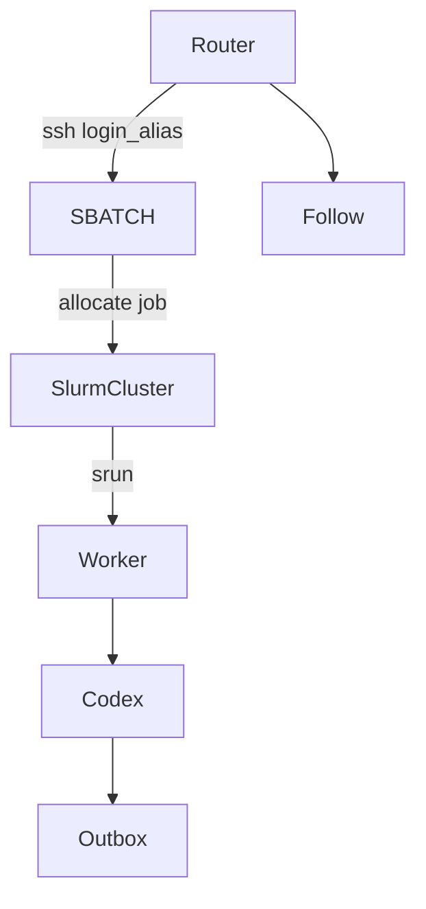
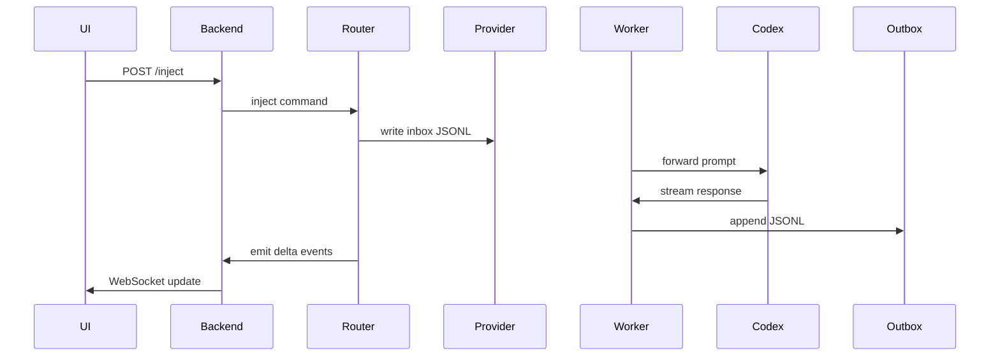

# Codeswarm Architecture

This document describes the current (post–provider abstraction) architecture of Codeswarm.

Codeswarm is a **provider-agnostic control plane** that orchestrates distributed Codex workers across multiple execution backends.

Currently supported providers:

- ✅ Local (subprocess execution)
- ✅ Slurm (HPC cluster execution)

The Router is completely unaware of SSH or Slurm semantics.

---

# 1. System Overview



---

# 2. Core Components

## 2.1 Frontend (Next.js)

Responsibilities:

- Render swarms and nodes
- Stream assistant output
- Derive attention indicators from completed turns
- Manage multi-node navigation (HPC-safe horizontal scroll model)

The frontend is **event-sourced**.

It does not poll cluster state.
It reacts to streamed router events.

---

## 2.2 Backend (Express)

Responsibilities:

- WebSocket bridge to frontend
- TCP bridge to router
- Durable swarm metadata (`state.json`)
- Reconciliation via `swarm_status`

The backend does not perform cluster operations.

---

## 2.3 Router (Control Plane)

The Router is the heart of Codeswarm.

Responsibilities:

- Maintain in-memory swarm registry
- Delegate cluster actions to provider
- Normalize worker events into router protocol
- Emit lifecycle events

The Router MUST NOT:

- Reference SSH
- Reference Slurm
- Reference login aliases

All cluster semantics are delegated to the Provider.

---

# 3. Provider Abstraction

The Router interacts with a provider via a minimal interface.



This ensures:

- Router is backend-agnostic
- New providers can be added without modifying router core

---

# 4. Worker Model

Workers run `codex_worker.py`.

Workers depend only on:

```
CODESWARM_JOB_ID
CODESWARM_NODE_ID
CODESWARM_BASE_DIR
CODESWARM_CODEX_BIN (optional)
```

Workers must NOT depend on:

- SLURM_*
- WORKSPACE_ROOT
- CLUSTER_SUBDIR

This guarantees portability.

---

# 5. Mailbox Contract

Workers communicate via JSONL mailbox files.

## Inbox

Used for injection.

```
mailbox/inbox/<job_id>_<node>.jsonl
```

## Outbox

Used for streaming events.

```
mailbox/outbox/<job_id>_<node>.jsonl
```

The Router follows outbox files and converts JSONL entries into protocol events.

---

# 6. Execution Models

## 6.1 Local Provider



- Workers run as local subprocesses
- Codex must be globally installed
- No SSH involved

Mailbox root:

```
runs/mailbox/
```

---

## 6.2 Slurm Provider



- Router delegates SSH to provider
- SBATCH script exports CODESWARM_* variables
- Workers run on compute nodes

Mailbox root:

```
<workspace>/<cluster_subdir>/mailbox/
```

---

# 7. Injection Lifecycle



---

# 8. Termination Model

Termination is provider-driven.

```
provider.terminate(job_id)
```

Local:
- Kill subprocesses

Slurm:
- `scancel` via SSH

Router:
- Marks swarm terminated
- Emits `swarm_terminated`

Router never executes SSH directly.

---

# 9. UI Scalability Model

Designed for HPC-scale swarms.

Features:

- Horizontal scroll with navigation arrows
- Non-shrinking node tiles
- Attention indicators
- Derived "needs input" state

The UI remains responsive for 1–128+ nodes.

---

# 10. Architectural Guarantees

- Router is provider-agnostic
- Workers are provider-neutral
- Mailbox is the single source of truth
- UI is event-driven
- Termination unified across providers

This architecture supports future providers (e.g., Kubernetes, Nomad, Ray) without modifying the control plane core.
